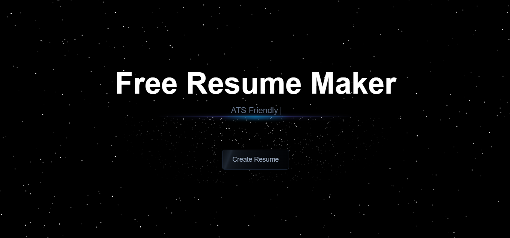

# 🚀 Free Resume Maker

A modern, ATS-optimized resume builder featuring professionally designed templates easy to use.



## ✨ Key Features

- **Multiple Professional Templates**: Choose from carefully crafted, industry-standard resume layouts
- **ATS-Friendly**: Engineered to pass Applicant Tracking Systems with flying colors
- **Real-time Preview**: Instant visual feedback as you build your resume
- **Drag & Drop Sections**: Easily customize section order to highlight your strengths
- **Modern UI/UX**: Clean, intuitive interface with a seamless user experience
- **Export to PDF**: One-click PDF download for your polished resume
- **Responsive Design**: Perfect resume building experience across all devices
- **Data Persistence**: Auto-saves your progress using local storage
- **Zero Cost**: Completely free and open-source

## 🛠️ Built With

- Next.js - React Framework
- Tailwind CSS - Styling
- React Beautiful DnD - Drag and Drop functionality
- React Icons - Professional icons
- Local Storage - Data persistence

## 📦 Installation

1. Clone the repository:
```bash
git clone https://github.com/HOTHEAD01TH/free-resume-maker.git
```

2. Navigate to the project directory:
```bash
cd free-resume-maker
```

3. Install dependencies:
```bash
npm install
```

4. Start the development server:
```bash
npm run dev
```

5. Open your browser and navigate to `http://localhost:3000` to see the application in action.


## 📝 Usage Tips

1. **Profile Section**: Start with your personal information and professional summary
2. **Experience & Projects**: Use action verbs and quantify achievements
3. **Skills & Certifications**: Include relevant technical and soft skills
4. **Customization**: Drag and drop sections to create the perfect layout
5. **Download**: Before downloading, disable header/footer in print settings for optimal PDF output

## 🤝 Contributing

Contributions are welcome! Please feel free to submit a Pull Request.

## 📄 License

This project is licensed under the MIT License - see the [LICENSE](LICENSE) file for details

## 🙏 Acknowledgments

- Special thanks to the open-source community and [Github Projects](https://x.com/githubprojects)
- Inspired by modern recruitment needs and ATS requirements

## ⚠️ Important Note

When downloading your resume as PDF, ensure you disable header and footer in your browser's print settings for the best results.

---

Made with ❤️ by Zaid for job seekers worldwide!
